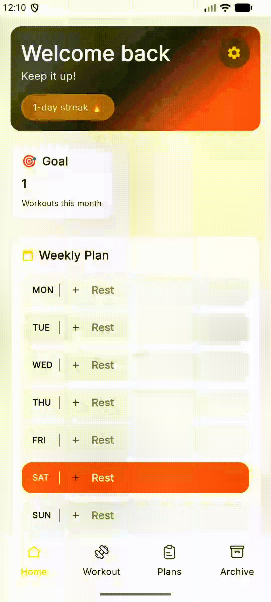

# Scheda Palestra

Create and keep track of your gym workouts!

A mobile app made with Flutter to plan and register your weekly workouts.

I made this app because I wanted to have an easy and simple way to plan my workout schedule at the Gym.

## 👀 See a Preview

## ✨ App Features:

- Create workout sheets : create your workouts, add exercises based on the type of training your aiming at (strenght, flexibility, swimming)
- Assign the workout to a day of the week : in the Home Page you can view the workouts assigned to each day of the week
- Workout View : check off each exercise as you complete it to finish your daily workout
- Workout Log : see your past workouts
- Local Back-up : all your data live in your phone only, a backup function is implemented to avoid losing your progresses if the app gets updated
- Support 4 languages (Italian, English, French, Spanish)

## 🛠️ Tech Stack

- Flutter
- Bloc for State Management
- DB : SQL Lite and Hive
- UI : Figma AI

As mentioned it is a cross-platform app made with the Flutter Framework, that can run on both IOS and Android.

While developing the app I choose a clean code architecture approach, coupled with the use of the Bloc library for State Management. This is an overkill for the app I built but the reason I chosed this approach was beacause I wanted to experiment with a State Management Library within Flutter and learn more about clean code in practice as this library is designed to follow that architectural structure.

For the Design i used Figma AI to generate the views and the components I needed. 

## Requirements

- Flutter SDK
- Dart SDK
- Android Studio
- XCode

